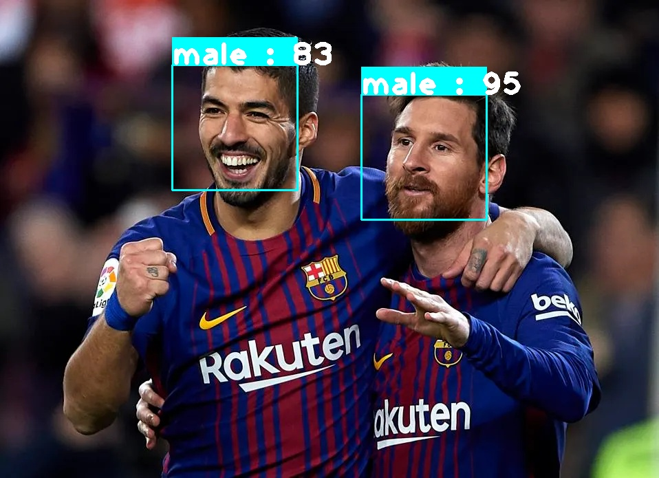

# Face Recognition Web App

This face recognition web app is integrated with a machine learning model. Here user can upload an image and our machine learning model will detect face and predict gender (Male or Female).

- **Course URL**: [Udemy](https://www.udemy.com/course/build-face-recognition-app-using-machine-learning-in-flask/?referralCode=E4241D27BEFE8D5E6C4D)

### Project Output

### Deployment
Here are some possible free hosting services where you can deploy your web application for a live demo:

-  Heroku
-  GitHub Pages
-  Netlify
-  Vercel
-  Firebase Hosting
-  Surge
-  Render
-  AWS Free Tier (limited usage)
-  Google Cloud Platform Free Tier (limited usage)

Each of these platforms offers different features and limitations, so you can choose based on your specific requirements and preferences.

